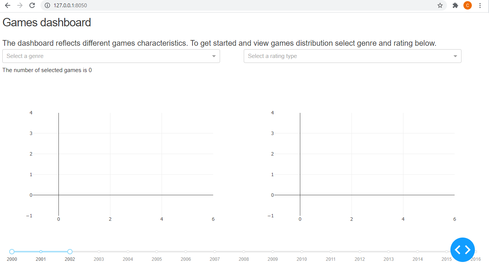
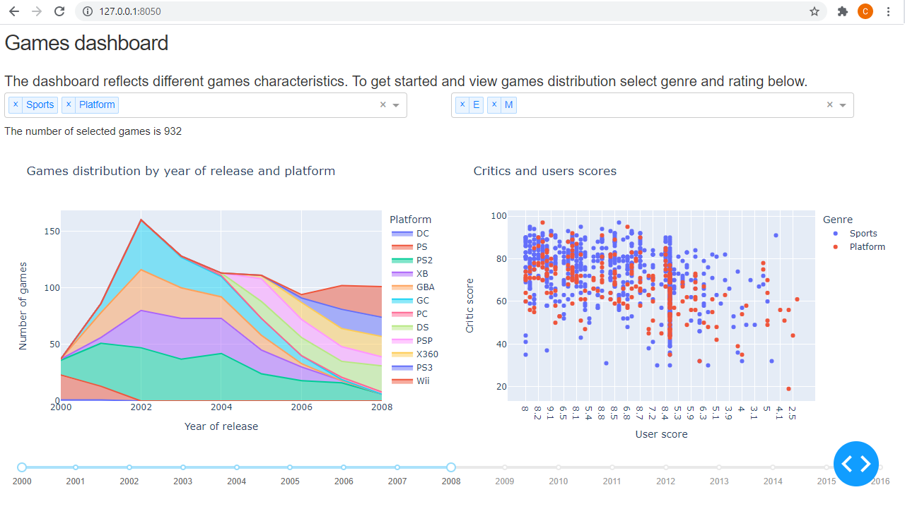

## Dash test assignment

Interactive graphs with filters, representing games statistics.

#### Description

The repository stores the files of my dash test assignment project:
- **dashboard.py** is python code;
- **games.csv** is required data;
- **screenshots** is a folder to store screenshots attached to README.md;
- on the second page of **test_assignment_description.pdf** an actual task may be found;
- **requirements.txt** is a file with required packages to run the code.

#### Running code

To run the code you have to clone the repository to your computer, create a virtual environment and execute the following command within it:
```
pip install -r requirements.txt
```
After that run **dashboard.py** and go to http://127.0.0.1:8050/ in your browser. You are going to see something like that:



If you select any filters the graphs will change. There is an example:


